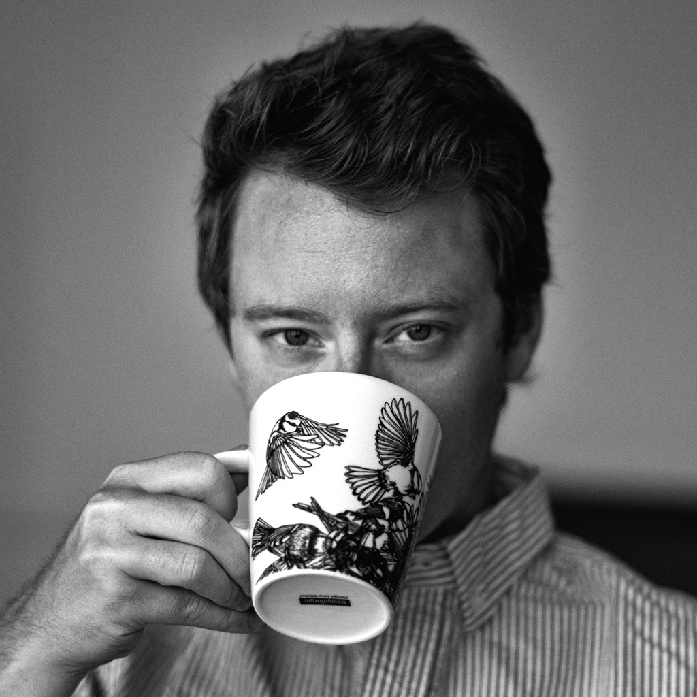

Hello. My name is Yoggi Firmanda. I'm a Indonesian living in Berlin since 2010. I have bachelor's degree in Bachelor of Science for 'Angewandte Informatik'(Applied Science of Informatic) at HTW Berlin(University of Applied Science Berlin).

I do really like to play football and badminton and i have passion for art and technology.

More information can be found through [LinkedIn](http://linkedin.com/pub/yoggi-firmanda/90/98b/858).

I currently work at [Netpoint-Media GmbH Berlin](http://www.netpoint-media.de/) as programmer.

<!-- - [Read more about my work with Spotify &rarr;](/about/spotify/) -->
<!-- - [Some of my favorite technical papers &rarr;](https://www.dropbox.com/sh/is0sy5350lr4v9j/AADQlhVSQcRw6vCNKQgGWelqa) -->

## Elsewhere

You can find me on a variety of world wild interweb sites where my username is usually "rsms".

- [Twitter](http://twitter.com/yoggifirmanda) — a good way to make contact
- [GitHub](https://github.com/cesgie) — code, juicy code
- [Instagram](http://instagram.com/yoggifirmanda/) — short stories via photo snapshots
<!-- - [Flickr](http://www.flickr.com/photos/rsms/) — photography -->
- [Facebook](http://www.facebook.com/yoggi.firmanda) — friends and foes

### [ @yoggifirmanda](http://twitter.com/yoggifirmanda)
